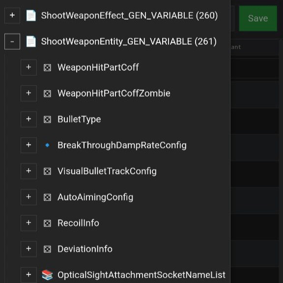
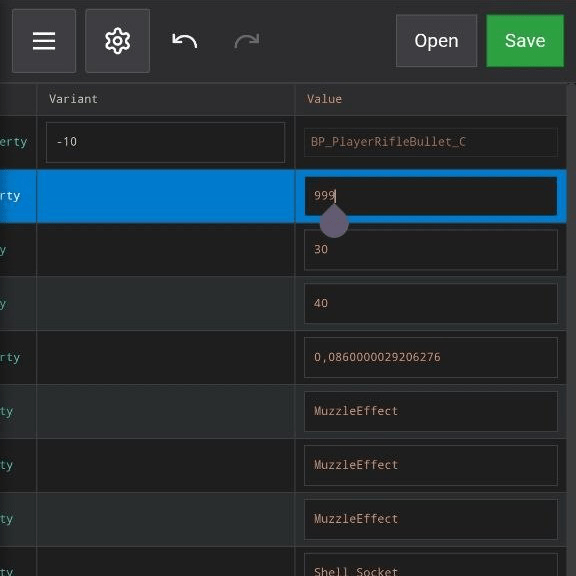
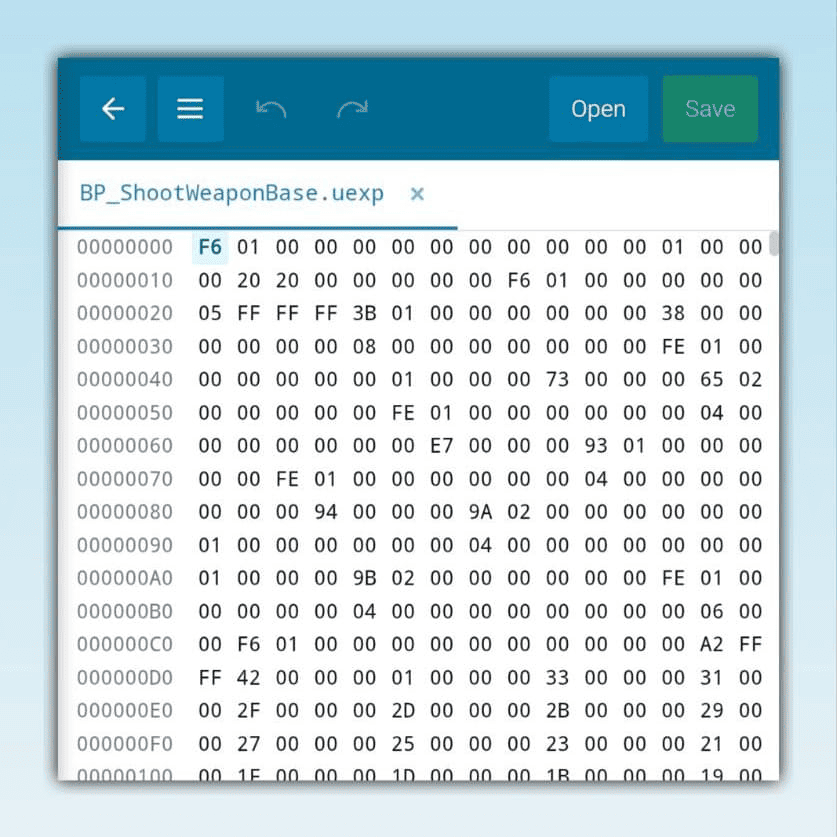

# Sace

   &nbsp;
   &nbsp;
   &nbsp;
  

 

---

<h2 id="features">🚀 About the Project</h2>

**Sace** is an advanced, low-level **Unreal Engine Asset Editor** that runs natively on Android. It provides a powerful mobile alternative to desktop tools like **UAssetGUI**, **UModel**, or **FModel**, allowing developers and modders to work without a PC.

With Sace, you can perform deep-level visual analysis of `.uasset` and `.uexp` files, edit properties, and conduct binary-level interventions via the integrated **Hex Editor**.

---

## ✨ Key Features

### 📦 Technical Asset Inspection (Viewer)
* **Full UE Support:** Compatible with Unreal Engine 4 and Unreal Engine 5 formats.
* **Low-Level Tree View:** Visualize complex nested data structures and object headers.
* **Property Manipulation:** Real-time editing for Integer, Float, Boolean, Name, and String types.
* **Binary Integrity:** Advanced save system that reconstructs `.uexp` data while maintaining file structure integrity.
* **On-the-go Hex Editing:** Perform manual byte-level modifications directly within the app.

---

## 📥 Download and Installation

The latest production build (APK) is available via GitHub Releases.

1. [Navigate to the Latest Release](../../releases).
2. Download the **`Sace.apk`** binary.
3. Install the package on your Android device (ensure "Install from Unknown Sources" is enabled).

---

 

  
  
  

 

---

   

  ### 📬 Contact & Support

   [Join our Telegram Channel](https://t.me/saceasset)
   
   [Send an Email](mailto:saceviewer@gmail.com)

   

